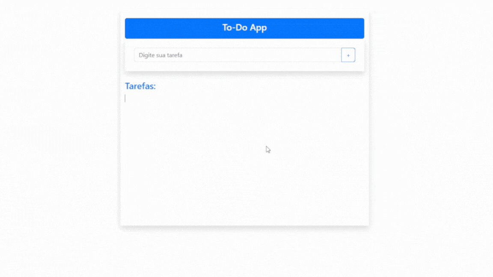

<h1 align="center">  TodoList 📝</h1>

<p align="center"> 🔗 <a href="https://todo-list-app-pearl-pi-86.vercel.app/">Acesse o projeto online</a> </p> 
<p align="center"> <a href="#-sobre-o-projeto">Sobre</a> 
• <a href="#-funcionalidades">Funcionalidades</a> 
• <a href="#-layout">Layout</a> 
• <a href="#-como-executar-o-projeto">Como executar</a> 
• <a href="#-tecnologias">Tecnologias</a> 
• <a href="#-autor">Autor</a> 
• <a href="#user-content--licença">Licença</a> </p>

<div align="center"> 
   
</div>

## 📌 Sobre o projeto

O **TodoList** é um aplicativo web de lista de tarefas simples e intuitivo, onde o usuário pode adicionar, editar e excluir tarefas do dia a dia. Ele foi desenvolvido com **Angular 17** e serviu como prática para a criação de páginas interativas com manipulação dinâmica de dados.

A aplicação utiliza **JSON Server** como backend fake, permitindo simular requisições HTTP (GET, POST, PUT, DELETE) para interações completas com uma **API REST**. Durante o desenvolvimento, foquei na construção de componentes reutilizáveis, organização modular do projeto e boas práticas com **Angular**.

<br>

## ⚙️ Funcionalidades

- ✅ Adição de novas tarefas
- ✅ Edição de tarefas existentes
- ✅ Exclusão de tarefas
- ✅ Interface limpa e responsiva
- ✅ Comunicação com API fake usando JSON Server
- ✅ Boas práticas com Angular, RxJS e TypeScript

<br>

## 🚀 Como executar o projeto

### Pré-requisitos

Antes de começar, você vai precisar ter instalado em sua máquina:

- [Node.js](https://nodejs.org/)
- [Angular CLI](https://angular.io/cli)
- [JSON Server](https://github.com/typicode/json-server)

<br>

### 📁 Clonando e executando o frontend (Angular)

```bash
# Clone o repositório
git clone https://github.com/MayconDoCarmo/TodoListApp.git

# Entre na pasta do projeto
cd TodoListApp

# Instale as dependências
npm install

# Inicie o servidor de desenvolvimento
ng serve
```

<br>

### 🧩 Executando o fake backend (JSON SERVER)

1. Coloque os arquivos PHP (API) em uma pasta no seu servidor local (ex: `htdocs/crud-users-api/`)
2. Certifique-se de que o banco de dados `crud_users` esteja criado e populado com a tabela:

```bash
# Rode o JSON Server apontando para o db.json
npx json-server --watch db.json
```

<br>

## 🛠 Tecnologias

#### **Frontend** (Angular 17)

- Angular 17
- Angular CLI
- TypeScript
- Bootstrap 5
- HTML5 / CSS3

#### **Backend Simulado**

- JSON Server
- HTTP REST API

<br>

## 🤝 Como contribuir para o projeto

1. Faça um **fork** do projeto.
2. Crie uma nova branch com suas alterações: `git checkout -b minha-feature`
3. Commit suas alterações: `git commit -m 'feat: Minha nova feature'`
4. Faça push para a sua branch: `git push origin minha-feature`

## 🦸 Autor

<table>
  <tr>
    <td align="center">
      <a href="#">
        <br>
        <sub>
          <b>Maycon Do Carmo</b>
        </sub>
      </a>
    </td>

</table>

[](mailto:maycongusmao.up@gmail.com)&nbsp;&nbsp;[](https://www.linkedin.com/in/maycon-do-carmo-9105b828b/)

## 📝 Licença

Este projeto está sob a licença [MIT](./LICENSE).

Feito com 💻 por **Maycon Do Carmo**
